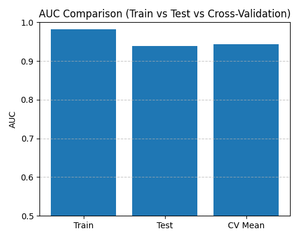

---

## Overfitting Diagnostic

| Metric | Value |
|:--------|:-------:|
| AUC (Train) | 0.9825 |
| AUC (Test)  | 0.9384 |
| Δ AUC (Train - Test) | 0.0440 |
| 5-Fold CV AUC | 0.9431 ± 0.0061 |

**Status:** ✅ Model generalizes well (no strong overfit signs)

---

## Interpretation
- ΔAUC > 0.05 → Possible overfitting ⚠️  
- ΔAUC ≈ 0 → Stable generalization ✅  
- ΔAUC < 0 → Possible underfitting 🧊  

